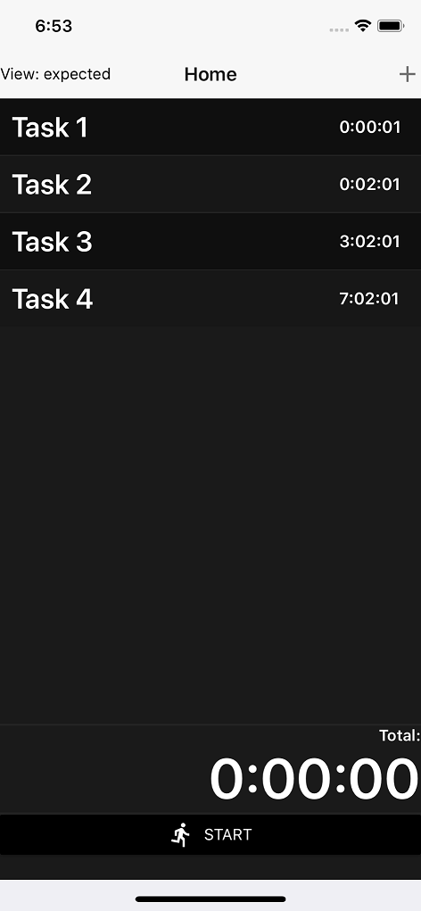
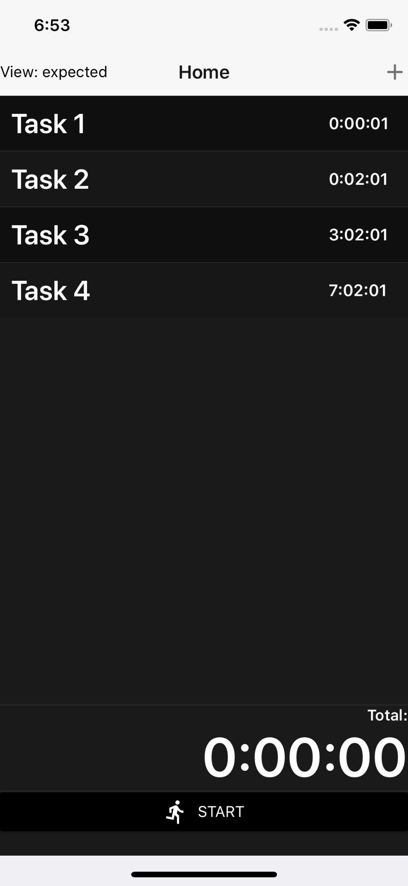
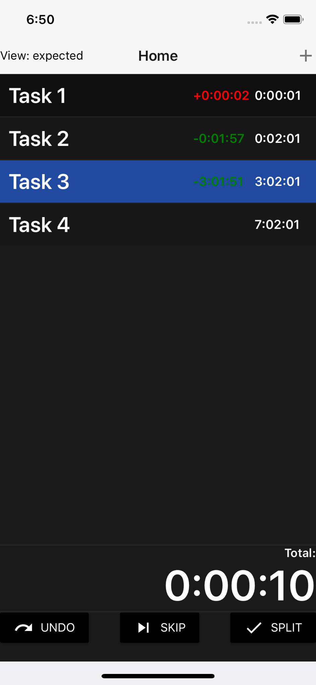

# IRL Speedrun
A timer app designed with the speed run philosophy in mind. 

## How it works
The program was written in react-native using the following libraries: flux, react-native-material-ui, react-navigation, react-native-swipeout. Design pattern consisted primarily of Container / Component strategy. Certain elements of Material Design was followed.

## Installation
In the irl-speedrun directory type:

```sh
> npm install
> npm start
```

Follow instructions from shell and choose to run from iOS or android emulator.

## Usage / Demo




## License
[MIT](https://choosealicense.com/licenses/mit/)